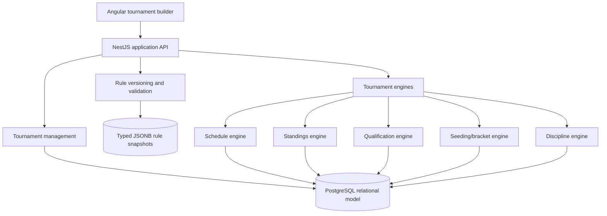
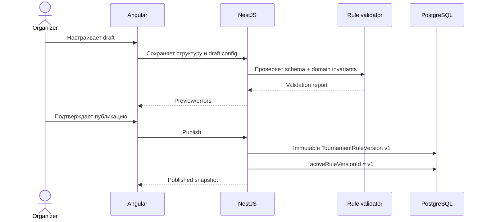

# Целевая архитектура

## Принцип

Конструктор разделяется на четыре слоя:

1. **Структура** — турнир, этапы, группы, участники, матчи.
2. **Контракт правил** — неизменяемая типизированная конфигурация.
3. **Движки** — календарь, таблица, квалификация, посев, матч и дисциплина.
4. **Операционные снимки** — подтверждённые таблицы, квалификация, сетка и решения.

## Backend-модули

Рекомендуемые границы NestJS-модулей:

- `tournaments` — агрегат, lifecycle, владелец и публикация;
- `tournament-stages` — структура этапов;
- `tournament-groups` — группы и состав;
- `tournament-members` — владельцы, организаторы и capabilities;
- `tournament-rules` — версии, schema validation и совместимость изменений;
- `scheduling` — генерация пар без назначения инфраструктуры;
- `standings-engine` — расчёт статистики и последовательных тай-брейков;
- `qualification-engine` — формирование preview и подтверждённого snapshot;
- `brackets` — посев, матчи сетки и источники участников;
- `discipline` — накопление событий и отбывание наказаний;
- `tournament-decisions` — жеребьёвки, технические результаты и аудит.

Движки не должны проверять название или slug конкретной лиги. Они принимают только нормализованные данные и соответствующий discriminated union правила.

## Поток публикации

## Frontend

Angular должен работать с серверными контрактами и не реализовывать турнирные правила самостоятельно.

Рекомендуемые области:

- `entities/tournament-stage`, `tournament-group`, `rule-version`;
- `features/tournament-builder` с шагами мастера;
- `features/group-assignment`;
- `features/rule-editor` для каталога поддерживаемых правил;
- `features/schedule-preview`;
- `features/qualification-preview`;
- `features/bracket-editor`;
- публичные виджеты `stage-tabs`, `group-standings`, `cross-group-ranking`, `knockout-bracket`.

Frontend получает от backend такие вычисленные признаки, как `qualificationStatus`, `placementReason`, `resolutionType` и `effectiveRuleVersion`. UI не должен угадывать выход по номеру строки.

## Контракт между backend и frontend

На этапе реализации типы правил должны иметь один канонический источник. Предпочтительный вариант — отдельный workspace-пакет TypeScript-контрактов без NestJS/Angular-зависимостей либо генерация frontend-типов из OpenAPI. Копирование несовпадающих enum вручную считается временным решением.

## Расширяемость

Новый формат добавляется как новый известный тип этапа или правила:

1. расширение discriminated union;
2. schema validator;
3. backend handler;
4. UI editor/renderer;
5. contract tests и upgrade для `schemaVersion`.

Первая версия не предоставляет пользователю DSL. Это ограничивает выразительность, но сохраняет безопасность, валидируемость и воспроизводимость результатов.

