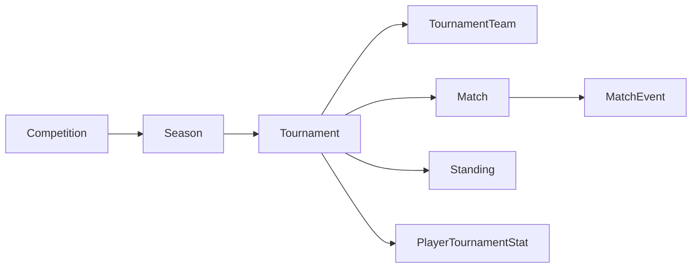

# Текущее состояние проекта

## Технологический контекст

- Backend: NestJS 11, TypeORM 0.3, PostgreSQL, `class-validator`, JWT и глобальные роли.
- Frontend: Angular 19, standalone-компоненты, signals/RxJS, route guards.
- База управляется TypeORM-миграциями; `synchronize` отключён.

## Существующая доменная цепочка

### Tournament

Содержит сезон, имя, slug, описание, `type`, `format`, даты, визуальные параметры и статус `planned | active | finished | cancelled`. Отдельных этапов и версии правил нет. `format=mixed` только маркирует формат, но не описывает его структуру.

### TournamentTeam

Связывает турнир и команду. `groupName` и `seedNumber` уже существуют, но группа не является самостоятельной сущностью, не имеет порядка, slug, этапа или ограничений состава.

### Match

Матч принадлежит турниру и содержит команды, площадку, дату, свободную строку `round`, статус и один счёт. Этап, группа, позиция в сетке, источник участника, отдельный счёт пенальти и способ определения победителя отсутствуют.

### Standings

Таблица уникальна по `(tournamentId, teamId)`. Перерасчёт:

- берёт все завершённые матчи турнира;
- создаёт строки только для команд, уже сыгравших матч;
- начисляет фиксированные `3/1/0`;
- API сортирует по очкам, разнице и забитым;
- не разделяет группы и этапы;
- не рассчитывает личные встречи и специальные решения организатора.

### Дисциплина

`PlayerTournamentStat` агрегирует карточки по турниру. Текущая логика:

- четыре жёлтые создают дисквалификацию на следующий уже запланированный матч;
- прямая красная и вторая жёлтая также дают дисквалификацию;
- после отбытия наказания счётчик из четырёх жёлтых сбрасывается;
- этап и политика переноса отсутствуют;
- если следующий матч ещё не создан или не имеет даты, наказание не получает надёжной привязки.

### Авторизация

Существуют глобальные роли `super_admin`, `admin`, `referee`, `captain`, `player`, `user`. Владение конкретным турниром и назначение его организаторов отсутствуют. Глобальная роль не подходит для изоляции пользовательских турниров.

### Frontend

Frontend умеет выбирать турнир сезона, показывать единый список матчей и одну таблицу. Цвет зоны таблицы выводится из позиции строки, а не из серверного результата квалификации. Конструктора турниров, представления этапов, нескольких групп и сетки нет.

## Главные архитектурные разрывы

| Область | Сейчас | Требуется |
|---|---|---|
| Структура | Один турнир без этапов | Турнир с упорядоченными этапами |
| Группы | Строка у команды | Реляционная сущность этапа |
| Правила | Константы в сервисах | Версионируемый типизированный контракт |
| Таблица | Одна, фиксированная | По этапу/группе, с цепочкой тай-брейков |
| Квалификация | Нет | Preview, подтверждение и snapshot |
| Плей-офф | Нет связной сетки | Источники участников и продвижение |
| Результат | Один счёт | Основное время, пенальти, technical resolution |
| Дисциплина | Состояние игрока в турнире | Правило этапа и отдельное наказание |
| Доступ | Только глобальные роли | Владение и membership турнира |
| Изменение правил | Не определено | Неизменяемые опубликованные версии |

## Вывод

Существующие сущности пригодны как основа, но добавление только `groupName` и нескольких условных веток приведёт к правилам, зашитым под конкретную лигу. Целевая модель должна отделить структуру соревнования от исполняющего её движка.

