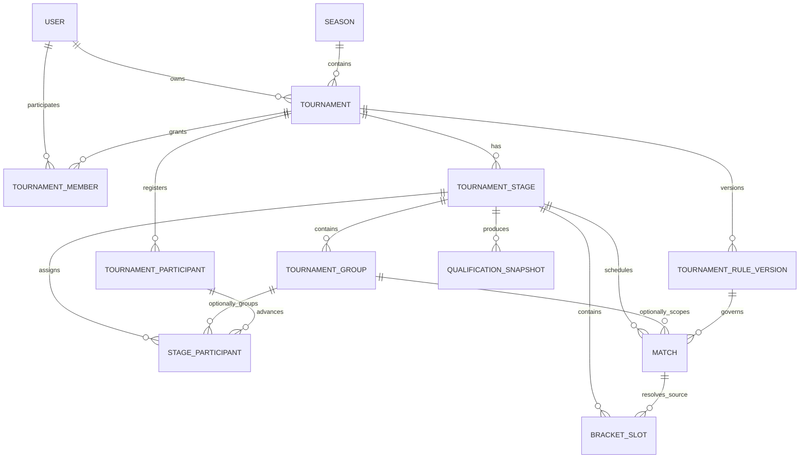

# Доменная модель

## Диаграмма сущностей

## Tournament

Корень агрегата турнира и контейнер этапов.

Предлагаемые поля:

| Поле | Назначение |
|---|---|
| `id`, `seasonId` | Существующая идентичность и принадлежность сезону |
| `ownerUserId` | Владелец пользовательского турнира |
| `name`, `slug`, `description` | Метаданные |
| `lifecycleStatus` | `draft | published | in_progress | completed` |
| `activeRuleVersionId` | Текущая опубликованная версия |
| `legacyMode` | Временный признак compatibility-режима |
| `startDate`, `endDate`, visual fields | Существующие поля |

Инварианты:

- slug уникален в согласованной области (рекомендуется внутри season или глобально с сохранением текущего поведения);
- владелец обязателен для новых пользовательских турниров;
- у опубликованного турнира есть активная опубликованная версия правил;
- этапы имеют уникальный `key` внутри турнира.

## TournamentStage

Упорядоченная структурная часть турнира.

| Поле | Назначение |
|---|---|
| `tournamentId` | Родительский агрегат |
| `key` | Стабильный ключ для ссылок из JSON, например `group-stage` |
| `name` | Отображаемое имя |
| `type` | `round_robin | group_stage | knockout` |
| `order` | Порядок выполнения |
| `status` | `pending | active | completed` |
| `startDate`, `endDate` | Необязательные границы |

### Типы этапов

- `round_robin` — единая таблица без групп; один или несколько кругов.
- `group_stage` — одна или несколько групп, таблица рассчитывается отдельно для каждой.
- `knockout` — сетка, в которой каждый матч обязан определить продвигаемую команду.

Структура этапа реляционная, а параметры его исполнения находятся в активной версии правил под тем же `stageKey`.

## TournamentGroup

Реляционная группа внутри `group_stage`.

| Поле | Назначение |
|---|---|
| `stageId` | Этап-владелец |
| `key` | Стабильный ключ `A`, `B`, `C` |
| `name` | Отображаемое название/район |
| `order` | Порядок в UI и генерации |
| `capacity` | Плановое ограничение состава |
| `status` | `draft | confirmed | completed` |

`TournamentGroup` запрещён для этапов, отличных от `group_stage`.

## TournamentRuleVersion

Неизменяемый после публикации снимок всех правил турнира.

| Поле | Назначение |
|---|---|
| `tournamentId` | Родительский турнир |
| `version` | Монотонный номер внутри турнира |
| `schemaVersion` | Версия структуры JSON-контракта |
| `status` | `draft | published | superseded` |
| `config` | JSONB `TournamentRulesConfig` |
| `basedOnVersionId` | Предыдущая опубликованная версия |
| `createdByUserId`, `publishedByUserId` | Аудит |
| `createdAt`, `publishedAt` | Временные метки |
| `changeSummary` | Обязательное описание post-publish изменения |

Запрещено обновлять `config` версии со статусом `published` или `superseded`.

## Поддерживающие сущности

### TournamentParticipant

Заменяет/эволюционирует `TournamentTeam`: регистрация команды в турнире независимо от её текущего этапа.

### StageParticipant

Назначение зарегистрированной команды в этап и, опционально, группу. Хранит seed, qualification source и статус. Это позволяет одной команде пройти из группы в плей-офф без создания нового турнира.

### Match

Сохраняет существующий `tournamentId`, но получает:

- `stageId`, опциональный `groupId`;
- `effectiveRuleVersionId`;
- структурированные `roundType`, `roundNumber`, `bracketPosition`;
- `winnerTeamId`, `resolutionType`;
- отдельные regulation/extra-time/penalty scores;
- опциональные источники участников до их определения.

Старые `round`, `homeScore`, `awayScore` сохраняются на переходный период.

### QualificationSnapshot

Подтверждённый результат перехода между этапами. Хранит входные показатели, выбранные команды, версию правил и автора подтверждения. Изменение исходного матча создаёт устаревшее состояние, но не переписывает snapshot молча.

### PlayerSuspension

Самостоятельное наказание с причиной, этапом применения, числом требуемых и отбытых матчей. Оно не зависит от того, существовал ли следующий матч в момент карточки.

### TournamentDecision

Аудируемое решение: жеребьёвка, technical result, ручной тай-брейк, штраф очков или изменение наказания.

## Реляционные данные и JSONB

### Реляционно хранятся

- идентичность, ownership и membership;
- этапы и группы;
- участники и назначения по этапам;
- матчи и связи сетки;
- версии правил и их статусы;
- подтверждённые snapshots;
- наказания и административные решения.

Причины: внешние ключи, уникальность, транзакции, запросы, аудит и целостность.

### В JSONB хранятся

- начисление очков;
- упорядоченные тай-брейки;
- параметры календаря;
- правила квалификации и посева;
- параметры определения победителя;
- дисциплинарные политики;
- правила перехода между этапами.

JSONB всегда проверяется по `schemaVersion` и TypeScript discriminated unions до сохранения. В JSON нельзя хранить ID операционных записей, если для них требуется FK; вместо этого используются стабильные `stageKey`, `groupKey` и известные rule types.

