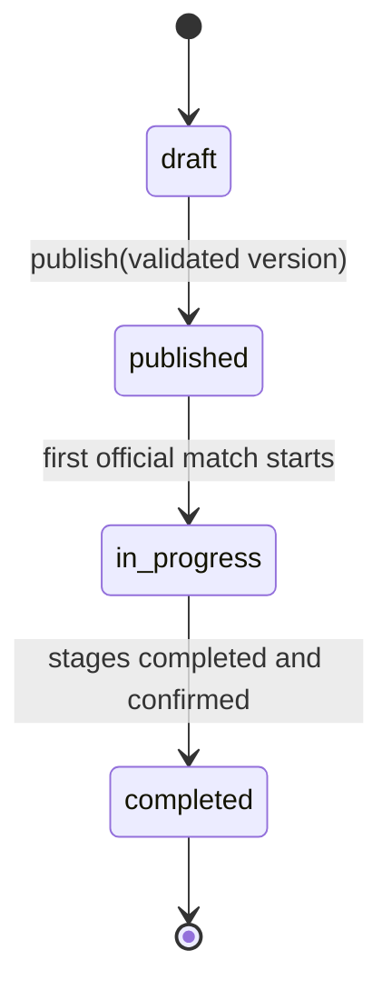

# Жизненный цикл, версии и доступ

## Жизненный цикл турнира



Отмена или архивирование могут быть добавлены как отдельные операционные признаки. Они не должны подменять основной lifecycle.

## Разрешённые действия

| Действие | draft | published | in_progress | completed |
|---|---:|---:|---:|---:|
| Метаданные без спортивного эффекта | да | да | да | ограниченно |
| Добавление/удаление этапа | да | нет | нет | нет |
| Изменение групп и квалификации | да | только через новую версию до старта | нет | нет |
| Изменение дисциплинарных правил | да | новая версия | только совместимое изменение с датой действия | нет |
| Генерация календаря | preview/save | да | только незавершённые матчи с аудитом | нет |
| Результаты и решения | нет | подготовка | да | только корректирующее решение |
| Завершение турнира | нет | нет | да, после валидации | уже завершён |

## Версионирование

### До первой публикации

Draft-версия изменяема. Публикация атомарно:

1. валидирует структуру и правила;
2. переводит версию в `published`;
3. устанавливает `activeRuleVersionId`;
4. переводит турнир в `published`.

### После публикации

Опубликованная версия неизменяема. Редактирование выполняется через fork:

```text
v1 published -> v2 draft (basedOn=v1) -> validation -> v2 published
```

При активации v2 версия v1 получает `superseded`, но остаётся доступной для исторического расчёта.

### Во время турнира

Изменение классифицируется:

- **presentation-only** — не влияет на спортивный результат;
- **forward-compatible** — влияет только на будущие события;
- **recalculation-required** — меняет уже рассчитанные таблицы/дисквалификации;
- **structural-forbidden** — ломает текущий этап или сетку.

`recalculation-required` требует preview различий, причины, подтверждения владельца и нового snapshot. `structural-forbidden` отклоняется после начала турнира.

Матчи, qualification snapshots, standings snapshots, suspensions и decisions сохраняют `effectiveRuleVersionId`.

## Владение и организаторы

### Модель

У нового турнира один `ownerUserId`. Дополнительный доступ хранится в `TournamentMember`:

```ts
type TournamentMemberRole = 'organizer' | 'viewer';

type TournamentCapability =
  | 'tournament.read_private'
  | 'tournament.edit_draft'
  | 'tournament.publish'
  | 'participants.manage'
  | 'schedule.manage'
  | 'results.manage'
  | 'discipline.manage'
  | 'decisions.manage'
  | 'members.manage';
```

Роль является удобным набором capabilities. Авторизация backend выполняется по capability на конкретный `tournamentId`, а не только по глобальной роли.

### Политика по умолчанию

| Субъект | Доступ |
|---|---|
| Владелец | Все capabilities, передача владения |
| Организатор | Делегированные capabilities, без передачи владения по умолчанию |
| Viewer | Чтение приватного draft/preview |
| Referee | Только назначенные матчи и протоколы |
| Captain | Своя команда, заявки и разрешённые действия |
| Public user | Только опубликованные данные |
| SuperAdmin | Аварийный глобальный override с аудитом |

Глобальный `admin` текущей системы не должен автоматически становиться владельцем всех будущих пользовательских турниров. На переходном этапе он может получать legacy-доступ через отдельную policy.

## Аудит

Обязательно фиксируются:

- публикация и смена версии;
- изменение membership;
- подтверждение квалификации и сетки;
- жеребьёвка;
- technical result и ручной тай-брейк;
- перерасчёт уже опубликованных результатов;
- super-admin override.

Удаление аудита и опубликованных версий через обычный API запрещено.

